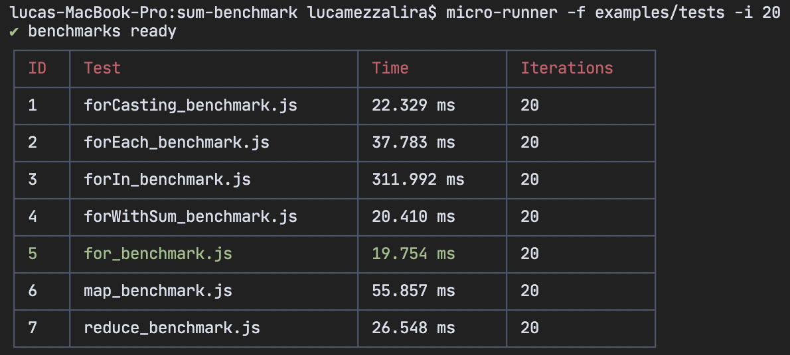

# Micro-Runner
### a CLI playground for benchmarking your JavaScript code 



The main aim behind Micro-Runner is making microbenchmarking accessible and fun.    
Often, web, mobile or desktop applications are suffering of poor performances and developers are struggling to analyze their applications performance and improve them.
Micro-Runner aims to run some code in isolation like you would do in a  playground, directly from your CLI, providing an immediate feedback when you want to compare the most performant implementation across multiple of them.


## Basic usage
```
micro-runner ./mybenchmark.js
```

Micro-Runner runs your test retrieving the benchmark of specific parts of your code displaying them in a table.    
The best Micro-Runner usage is for comparing similar alghortims with different implementations.   
Micro-Runner is a playground for learning how fast some code may run in isolation.   
It can be used for running benchmarks on different machine not only locally (_UNDER DEVELOPMENT_).   

## CLI arguments

```
micro-runner ./mybenchmark.js
```
Micro-Runner requires at least a file to run a benchmark on.    
When you need to specify multiple file please use the folder argument as specified in this guide.

```
micro-runner -i 10 ./mybenchmark.js
```
-i corresponds to the number of iterations you wanna run per benchmark, it has to be an integer and can be a **number from 1 to 500**. When the parameter provided is larger than 500, the iterations per benchmark will be 100.   
When this parameter is not specified the **default value is 10**.

_If you have many tests and you set 500 iterations per benchmark be aware it could take a while._

```
micro-runner -f ./benchmarks
```
-f is used for specifying a folder with JavaScript files. Every single JavaScript file in that folder will run sequentially one after the other.

## Benchmark anatomy

TBD

### Contacts
For any additional info or ideas feel free to [reach me out](mailto:mezzalab@gmail.com)